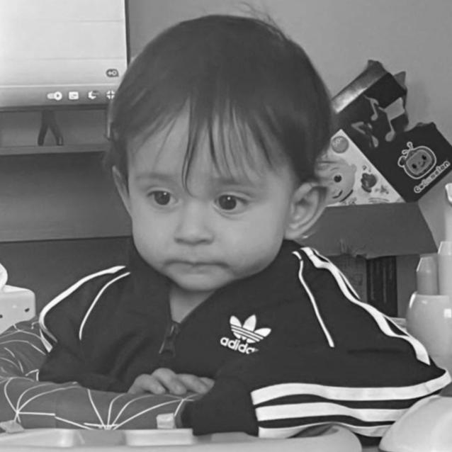
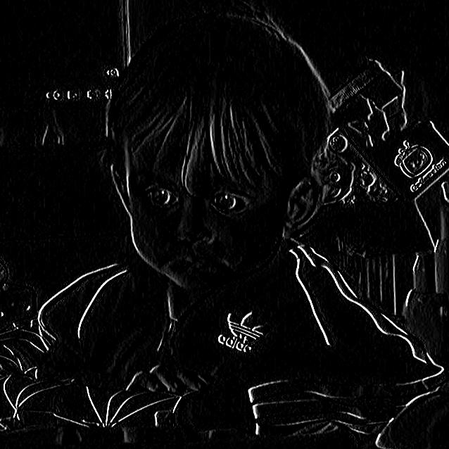

# Nasm Image Processor

This project implements various image processing operations in Assembly and Python. It combines low-level Assembly functions for high-performance operations with Python scripts for easier control and automation, allowing users to apply complex transformations like resizing, reshaping, filtering, and more.

---

## ✨ Features

- **Dual-Language Implementation**: Combines the speed of Assembly with the versatility of Python for streamlined image processing.
- **Comprehensive Image Transformations**: Supports reshaping, resizing, grayscale conversion, gaussian blur and edge detection.

---

## 📋 Prerequisites

- **Assembler**: Install an assembler like NASM to compile Assembly code.
- **Python 3.7 or higher**: Required to run Python scripts that interface with Assembly functions.
- **Python Libraries**:
  - **Pillow**: For image handling in Python.
  - **NumPy**: For numerical operations and data handling.

---

## 🔧 Operations Overview

- **Open Image**: Load an image with python take_input.py.
- **Apply Filters**: Run the main.asm then choose and apply filters.
- **Output Image**: Save the output image running the needed python take_output file.

---

## 🖼️ Example Images
> Below are some snapshots showing different states of the game:

  
  

  
  

